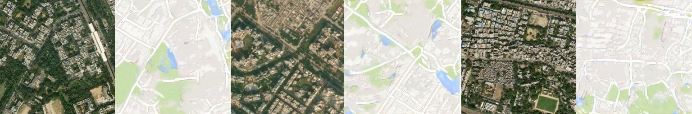
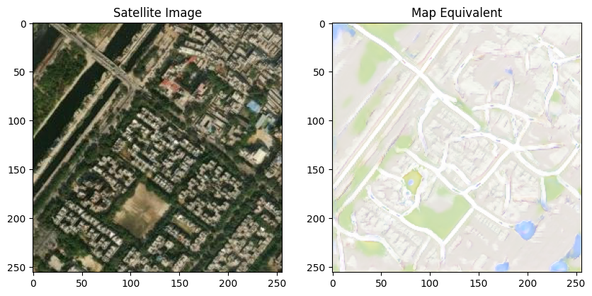

<a name = "0"></a>
# GAN for Image to Map

Generative Adversarial Networks with conditional input are useful for generating dataset conditioned on the input. This can be used to convert satellite images to maps as well. This notebook uses the Pix2Pix model described by [*Image-to-Image Translation with Conditional Adversarial Networks*](https://arxiv.org/abs/1611.07004) by Isola et al. 2017, to convert satellite images to maps. We will also implement the loss function described in the same paper by ourselves.



__Table of Content__
- [Pix2Pix](#1)

  - [Goals](#0.1)

  - [Getting Started](#1)

    - [Download Image-Map Pairs](#1.1)

      - [Download multiple satellite image - map pairs](#1.1.1)

    - [Obtain the data provided by the authors of Pix2Pix](#1.2)

      - [Download Data](#1.2.1)

      - [Download pretrained weights](#1.2.2)

    - [Mounting the drive](#1.3)

    - [Import libraries](#1.4)

  - [Model Code](#2)

    - [U-Net Code](#2.1)

    - [PatchGAN Discriminator](#2.2)

    - [Model hyperparameters and other parameters](#2.3)

  - [For Training Only](#3)

    - [Pix2Pix Training](#3.1)

  - [Make predictions](#4)


<a name = "1"></a>
## Getting Started
First download the data and import the required packages.

<a name = "1.1"></a>
### Download Image-Map Pairs
The functions defined below can be used to download satellite image tiles and corresponding osm tiles from ESRI World Imagery and OpenStreetMaps respectively.

We will use this to download test images for some area of interest for seeing how the model prediction look at the end of this notebook.


```python
import math
import os
import requests
# Define the base URLs for OpenStreetMap and Esri imagery tiles
osm_url = "https://tile.openstreetmap.org/{z}/{y}/{x}.png"
esri_url = "https://server.arcgisonline.com/ArcGIS/rest/services/World_Imagery/MapServer/tile/{z}/{y}/{x}"

def deg2num(lat_deg, lon_deg, zoom):
  lat_rad = math.radians(lat_deg)
  n = 1 << zoom
  xtile = int((lon_deg + 180.0) / 360.0 * n)
  ytile = int((1.0 - math.asinh(math.tan(lat_rad)) / math.pi) / 2.0 * n)
  return xtile, ytile, zoom

def num2deg(xtile, ytile, zoom):
  n = 1 << zoom
  lon_deg = xtile / n * 360.0 - 180.0
  lat_rad = math.atan(math.sinh(math.pi * (1 - 2 * ytile / n)))
  lat_deg = math.degrees(lat_rad)
  return lat_deg, lon_deg

def download_osm(x, y, z, save_path = "."):
  # Format the URL with the coordinates
  tile_url = osm_url.format(x=x, y=y, z=z)

  response = requests.get(tile_url, headers={'User-Agent': 'smopy'})
  if response.status_code == 200:
    # Save the tile as 'tile.png' in the current directory
    file_name = f"{y}_{x}_{z}.png"
    open(os.path.join(save_path, file_name), 'wb').write(response.content)
    print(f"saved image: {file_name}")
    return True
  else:
    file_name = f" from OSM : {y}_{x}_{z}"
    # Return False if unsuccessful
    print(f"Download failed: {file_name}")
    return False

# Define a function to download and save a tile from a given URL and coordinates
def download_esri(y,x, z, save_path = "."):
  # Format the URL with the coordinates
  tile_url = esri_url.format(x=x, y=y, z=z)
  # Send a GET request to the URL and check the status code
  response = requests.get(tile_url)
  if response.status_code == 200:
    # Get the content type from the response headers
    content_type = response.headers['Content-Type']
    # Get the file extension from the content type
    ext = content_type.split('/')[-1]
    # Construct the file name from the coordinates and extension
    file_name = f"{x}_{y}_{z}.{ext}"
    # Write the response content to a file in binary mode
    with open(os.path.join(save_path, file_name), 'wb') as f:
      f.write(response.content)
    # Return True if successful
    print(f"saved image: {file_name}")
    return True
  else:
    file_name = f" from esri : {x}_{y}_{z}"
    # Return False if unsuccessful
    print(f"Download failed: {file_name}")
    return False

def get_tile_for_location(x, y, z, source = "esri", output = "."):
  x,y,z = deg2num(y, x, 16)
  if source == "esri":
    download_esri(y,x,z, save_path = output)
  else:
    download_osm(y,x,z, save_path = output)
```

<a name = "1.1.1"></a>
#### Download multiple satellite image - map pairs
<p style = "color:red; font-size: 1.5em;"> Only if you want to train the data on your custom data, run the three cells below. Otherwise skip them.</p><br>
For your area of interest. You will need to specify the correct directory, extent and number of tiles. Do this only if you have tried training the model once with the provided data from the authors of Pix2Pix.


```python
home = "/content"
maps_path = os.path.join(home, "maps")
esri_path = os.path.join(maps_path, "esri")
osm_path = os.path.join(maps_path, "osm")
if not os.path.exists(maps_path):
    os.mkdir(maps_path)
if not os.path.exists(esri_path):
    os.mkdir(esri_path)
if not os.path.exists(osm_path):
    os.mkdir(osm_path)


min_lon = -87.6833
max_lon = -86.4833
min_lat = 33.1333
max_lat = 34.3333

max_counts = 300
max_cols = int(max_counts ** (0.5))
count = 0
count_cols = 0

x,y,z = deg2num(max_lat, min_lon, 16)

while count < max_counts:
  count_cols = 0
  while count_cols < max_cols:
    download_esri(y,x,z)
    download_osm(y,x,z)
    y += 1
    count_cols += 1
    count += 1
    print(f"Downloaded {count} image-map pair{'s' if count >1 else ''}.")
  x += 1
```


```python
from PIL import Image

def concat_images(image1, image2, out_dir = "."):
  # open the images as PIL objects
  img1 = Image.open(image1)
  img2 = Image.open(image2)

  # get the dimensions of the images
  width1, height1 = img1.size
  width2, height2 = img2.size

  # create a new image with the combined width and the maximum height
  new_width = width1 + width2
  new_height = max(height1, height2)
  new_image = Image.new("RGB", (new_width, new_height))

  # paste the images side by side on the new image
  new_image.paste(img1, (0, 0))
  new_image.paste(img2, (width1, 0))
  out_name = "merged_" + image1.split("/")[-1][4:]
  # save the new image as png
  new_image.save(os.path.join(out_dir, out_name))
  del new_image
```


```python
combined_path = os.path.join(home, "combined")
if not os.path.exists(combined_path):
    os.mkdir(combined_path)
images = os.listdir('/content/maps/esri')
maps = os.listdir('/content/maps/osm')
images.sort()
maps.sort()
for i,m in zip(images, maps):
  concat_images(os.path.join(esri_path,i), os.path.join(osm_path, m), combined_path)
```


```python
import shutil

try:
  os.mkdir("train")
except:
  pass
images = os.listdir('/content/maps/esri')
maps = os.listdir('/content/maps/osm')
images.sort()
maps.sort()
count = 0
for i in images:
  try:
    os.mkdir(f"train/pair_{count}")
  except:
    print(f"Could not make directory for pair {count}.")
  try:
    shutil.move(os.path.join(esri_path,i), os.path.join(f"train/pair_{count}", i))
  except:
    print(f"could not move file {i}")
  try:
    shutil.move(os.path.join(osm_path, i.replace(".jpeg", ".png")), os.path.join(f"train/pair_{count}", i.replace(".jpeg", ".png")))
  except:
    print(f"could not move file {m}")
  print(f"Moved file {i}, {m}.")
  count += 1
```

<a name = "1.2"></a>
### Obtain the data provided by the authors of Pix2Pix as well as pretrained weights

<a name = "1.2.1"></a>
#### Download data


```python
!wget http://efrosgans.eecs.berkeley.edu/pix2pix/datasets/maps.tar.gz
```

    --2023-06-14 22:32:05--  http://efrosgans.eecs.berkeley.edu/pix2pix/datasets/maps.tar.gz
    Resolving efrosgans.eecs.berkeley.edu (efrosgans.eecs.berkeley.edu)... 128.32.244.190
    Connecting to efrosgans.eecs.berkeley.edu (efrosgans.eecs.berkeley.edu)|128.32.244.190|:80... connected.
    HTTP request sent, awaiting response... 200 OK
    Length: 250242400 (239M) [application/x-gzip]
    Saving to: ‘maps.tar.gz’
    
    maps.tar.gz         100%[===================>] 238.65M  1.04MB/s    in 2m 26s  
    
    2023-06-14 22:34:32 (1.63 MB/s) - ‘maps.tar.gz’ saved [250242400/250242400]
    
    


```python
%%capture
!tar -xzvf "/content/maps.tar.gz" -C "/content"
```


```python
#!wget http://efrosgans.eecs.berkeley.edu/pix2pix/models-pytorch/sat2map.pth
```

    --2023-06-14 17:45:13--  http://efrosgans.eecs.berkeley.edu/pix2pix/models-pytorch/sat2map.pth
    Resolving efrosgans.eecs.berkeley.edu (efrosgans.eecs.berkeley.edu)... 128.32.244.190
    Connecting to efrosgans.eecs.berkeley.edu (efrosgans.eecs.berkeley.edu)|128.32.244.190|:80... connected.
    HTTP request sent, awaiting response... 200 OK
    Length: 217704720 (208M)
    Saving to: ‘sat2map.pth’
    
    sat2map.pth         100%[===================>] 207.62M  15.0MB/s    in 17s     
    
    2023-06-14 17:45:30 (12.4 MB/s) - ‘sat2map.pth’ saved [217704720/217704720]
    
    

<a name = "1.2.2"></a>
#### Download pretrained weights


```python
!gdown 1-8xbF8BfsxukX996IgpV7hHFlGKUjKSX
```

    Downloading...
    From: https://drive.google.com/uc?id=1-8xbF8BfsxukX996IgpV7hHFlGKUjKSX
    To: /content/sat3mapnewer.pth
    100% 1.41G/1.41G [00:17<00:00, 83.1MB/s]
    

<a name = "1.3"></a>
#### Mounting the drive
As the model training takes a long time, if you are using colab, it might run out of a runtime and delete everything. So to avoid that, mount the drive and save the results there.


```python
from google.colab import drive
import os
drive.mount('/content/drive')
gan_path = 'drive/MyDrive/GAN'
pretrained_path =

if not os.path.exists(gan_path):
  os.mkdir(gan_path)
```

    Mounted at /content/drive
    

<a name = "1.4"></a>
#### Import libraries


```python
import torch
from torch import nn
from tqdm.auto import tqdm
from torchvision import transforms
from torchvision.datasets import VOCSegmentation
from torchvision.utils import make_grid
from torch.utils.data import DataLoader
import matplotlib.pyplot as plt
torch.manual_seed(0)

def show_tensor_images(image_tensor, num_images=25, size=(1, 28, 28)):
    '''
    Function for visualizing images: Given a tensor of images, number of images, and
    size per image, plots and prints the images in an uniform grid.
    '''
    image_shifted = image_tensor
    image_unflat = image_shifted.detach().cpu().view(-1, *size)
    image_grid = make_grid(image_unflat[:num_images], nrow=5)
    plt.imshow(image_grid.permute(1, 2, 0).squeeze())
    plt.show()
```

<a name = "2"></a>
### Model Code

<a name = "2.1"></a>
#### U-Net Code

The generator for Pix2Pix uses a U-net architechture.


```python
def crop(image, new_shape):
    '''
    Function for cropping an image tensor: Given an image tensor and the new shape,
    crops to the center pixels (assumes that the input's size and the new size are
    even numbers).
    Parameters:
        image: image tensor of shape (batch size, channels, height, width)
        new_shape: a torch.Size object with the shape you want x to have
    '''
    middle_height = image.shape[2] // 2
    middle_width = image.shape[3] // 2
    starting_height = middle_height - new_shape[2] // 2
    final_height = starting_height + new_shape[2]
    starting_width = middle_width - new_shape[3] // 2
    final_width = starting_width + new_shape[3]
    cropped_image = image[:, :, starting_height:final_height, starting_width:final_width]
    return cropped_image

class ContractingBlock(nn.Module):
    '''
    ContractingBlock Class
    Performs two convolutions followed by a max pool operation.
    Values:
        input_channels: the number of channels to expect from a given input
    '''
    def __init__(self, input_channels, use_dropout=False, use_bn=True):
        super(ContractingBlock, self).__init__()
        self.conv1 = nn.Conv2d(input_channels, input_channels * 2, kernel_size=3, padding=1)
        self.conv2 = nn.Conv2d(input_channels * 2, input_channels * 2, kernel_size=3, padding=1)
        self.activation = nn.LeakyReLU(0.2)
        self.maxpool = nn.MaxPool2d(kernel_size=2, stride=2)
        if use_bn:
            self.batchnorm = nn.BatchNorm2d(input_channels * 2)
        self.use_bn = use_bn
        if use_dropout:
            self.dropout = nn.Dropout()
        self.use_dropout = use_dropout

    def forward(self, x):
        '''
        Function for completing a forward pass of ContractingBlock:
        Given an image tensor, completes a contracting block and returns the transformed tensor.
        Parameters:
            x: image tensor of shape (batch size, channels, height, width)
        '''
        x = self.conv1(x)
        if self.use_bn:
            x = self.batchnorm(x)
        if self.use_dropout:
            x = self.dropout(x)
        x = self.activation(x)
        x = self.conv2(x)
        if self.use_bn:
            x = self.batchnorm(x)
        if self.use_dropout:
            x = self.dropout(x)
        x = self.activation(x)
        x = self.maxpool(x)
        return x

class ExpandingBlock(nn.Module):
    '''
    ExpandingBlock Class:
    Performs an upsampling, a convolution, a concatenation of its two inputs,
    followed by two more convolutions with optional dropout
    Values:
        input_channels: the number of channels to expect from a given input
    '''
    def __init__(self, input_channels, use_dropout=False, use_bn=True):
        super(ExpandingBlock, self).__init__()
        self.upsample = nn.Upsample(scale_factor=2, mode='bilinear', align_corners=True)
        self.conv1 = nn.Conv2d(input_channels, input_channels // 2, kernel_size=2)
        self.conv2 = nn.Conv2d(input_channels, input_channels // 2, kernel_size=3, padding=1)
        self.conv3 = nn.Conv2d(input_channels // 2, input_channels // 2, kernel_size=2, padding=1)
        if use_bn:
            self.batchnorm = nn.BatchNorm2d(input_channels // 2)
        self.use_bn = use_bn
        self.activation = nn.ReLU()
        if use_dropout:
            self.dropout = nn.Dropout()
        self.use_dropout = use_dropout

    def forward(self, x, skip_con_x):
        '''
        Function for completing a forward pass of ExpandingBlock:
        Given an image tensor, completes an expanding block and returns the transformed tensor.
        Parameters:
            x: image tensor of shape (batch size, channels, height, width)
            skip_con_x: the image tensor from the contracting path (from the opposing block of x)
                    for the skip connection
        '''
        x = self.upsample(x)
        x = self.conv1(x)
        skip_con_x = crop(skip_con_x, x.shape)
        x = torch.cat([x, skip_con_x], axis=1)
        x = self.conv2(x)
        if self.use_bn:
            x = self.batchnorm(x)
        if self.use_dropout:
            x = self.dropout(x)
        x = self.activation(x)
        x = self.conv3(x)
        if self.use_bn:
            x = self.batchnorm(x)
        if self.use_dropout:
            x = self.dropout(x)
        x = self.activation(x)
        return x

class FeatureMapBlock(nn.Module):
    '''
    FeatureMapBlock Class
    The final layer of a U-Net -
    maps each pixel to a pixel with the correct number of output dimensions
    using a 1x1 convolution.
    Values:
        input_channels: the number of channels to expect from a given input
        output_channels: the number of channels to expect for a given output
    '''
    def __init__(self, input_channels, output_channels):
        super(FeatureMapBlock, self).__init__()
        self.conv = nn.Conv2d(input_channels, output_channels, kernel_size=1)

    def forward(self, x):
        '''
        Function for completing a forward pass of FeatureMapBlock:
        Given an image tensor, returns it mapped to the desired number of channels.
        Parameters:
            x: image tensor of shape (batch size, channels, height, width)
        '''
        x = self.conv(x)
        return x

class UNet(nn.Module):
    '''
    UNet Class
    A series of 4 contracting blocks followed by 4 expanding blocks to
    transform an input image into the corresponding paired image, with an upfeature
    layer at the start and a downfeature layer at the end.
    Values:
        input_channels: the number of channels to expect from a given input
        output_channels: the number of channels to expect for a given output
    '''
    def __init__(self, input_channels, output_channels, hidden_channels=32):
        super(UNet, self).__init__()
        self.upfeature = FeatureMapBlock(input_channels, hidden_channels)
        self.contract1 = ContractingBlock(hidden_channels, use_dropout=True)
        self.contract2 = ContractingBlock(hidden_channels * 2, use_dropout=True)
        self.contract3 = ContractingBlock(hidden_channels * 4, use_dropout=True)
        self.contract4 = ContractingBlock(hidden_channels * 8)
        self.contract5 = ContractingBlock(hidden_channels * 16)
        self.contract6 = ContractingBlock(hidden_channels * 32)
        self.expand0 = ExpandingBlock(hidden_channels * 64)
        self.expand1 = ExpandingBlock(hidden_channels * 32)
        self.expand2 = ExpandingBlock(hidden_channels * 16)
        self.expand3 = ExpandingBlock(hidden_channels * 8)
        self.expand4 = ExpandingBlock(hidden_channels * 4)
        self.expand5 = ExpandingBlock(hidden_channels * 2)
        self.downfeature = FeatureMapBlock(hidden_channels, output_channels)
        self.sigmoid = torch.nn.Sigmoid()

    def forward(self, x):
        '''
        Function for completing a forward pass of UNet:
        Given an image tensor, passes it through U-Net and returns the output.
        Parameters:
            x: image tensor of shape (batch size, channels, height, width)
        '''
        x0 = self.upfeature(x)
        x1 = self.contract1(x0)
        x2 = self.contract2(x1)
        x3 = self.contract3(x2)
        x4 = self.contract4(x3)
        x5 = self.contract5(x4)
        x6 = self.contract6(x5)
        x7 = self.expand0(x6, x5)
        x8 = self.expand1(x7, x4)
        x9 = self.expand2(x8, x3)
        x10 = self.expand3(x9, x2)
        x11 = self.expand4(x10, x1)
        x12 = self.expand5(x11, x0)
        xn = self.downfeature(x12)
        return self.sigmoid(xn)
```

<a name = "2.2"></a>
#### PatchGAN Discriminator

The descriminator classifies if the patches of generated images look real or fake.


```python
# Discriminator Class
class Discriminator(nn.Module):
    '''
    Discriminator Class
    Structured like the contracting path of the U-Net, the discriminator will
    output a matrix of values classifying corresponding portions of the image as real or fake.
    Parameters:
        input_channels: the number of image input channels
        hidden_channels: the initial number of discriminator convolutional filters
    '''
    def __init__(self, input_channels, hidden_channels=8):
        super(Discriminator, self).__init__()
        self.upfeature = FeatureMapBlock(input_channels, hidden_channels)
        self.contract1 = ContractingBlock(hidden_channels, use_bn=False)
        self.contract2 = ContractingBlock(hidden_channels * 2)
        self.contract3 = ContractingBlock(hidden_channels * 4)
        self.contract4 = ContractingBlock(hidden_channels * 8)

        self.final = nn.Conv2d(hidden_channels * 16, 1, kernel_size=1)


    def forward(self, x, y):
        x = torch.cat([x, y], axis=1)
        x0 = self.upfeature(x)
        x1 = self.contract1(x0)
        x2 = self.contract2(x1)
        x3 = self.contract3(x2)
        x4 = self.contract4(x3)
        xn = self.final(x4)
        return xn
```

<a name = "2.3"></a>
#### Model hyperparameters and other parameters

Now you can begin putting everything together for training. You start by defining some new parameters as well as the ones you are familiar with:
  *   **real_dim**: the number of channels of the real image and the number expected in the output image
  *   **adv_criterion**: an adversarial loss function to keep track of how well the GAN is fooling the discriminator and how well the discriminator is catching the GAN
  *   **recon_criterion**: a loss function that rewards similar images to the ground truth, which "reconstruct" the image
  *   **lambda_recon**: a parameter for how heavily the reconstruction loss should be weighed
  *   **n_epochs**: the number of times you iterate through the entire dataset when training
  *   **input_dim**: the number of channels of the input image
  *   **display_step**: how often to display/visualize the images
  *   **batch_size**: the number of images per forward/backward pass
  *   **lr**: the learning rate
  *   **target_shape**: the size of the output image (in pixels)
  *   **device**: the device type


```python
import torch.nn.functional as F
# New parameters
adv_criterion = nn.BCEWithLogitsLoss()
recon_criterion = nn.L1Loss()
lambda_recon = 200

n_epochs = 20
input_dim = 3
real_dim = 3
display_step = 200
batch_size = 4
lr = 0.0002
target_shape = 256
device = 'cpu' # change this to 'cuda' if running with GPU
```

Next, you can initialize your generator (U-Net) and discriminator, as well as their optimizers. Finally, you will also load your pre-trained model.


```python
gen = UNet(input_dim, real_dim).to(device)
```


```python
import os
gen = UNet(input_dim, real_dim).to(device)
gen_opt = torch.optim.Adam(gen.parameters(), lr=lr)
disc = Discriminator(input_dim + real_dim).to(device)
disc_opt = torch.optim.Adam(disc.parameters(), lr=lr)

def weights_init(m):
    if isinstance(m, nn.Conv2d) or isinstance(m, nn.ConvTranspose2d):
        torch.nn.init.normal_(m.weight, 0.0, 0.02)
    if isinstance(m, nn.BatchNorm2d):
        torch.nn.init.normal_(m.weight, 0.0, 0.02)
        torch.nn.init.constant_(m.bias, 0)

# Feel free to change pretrained to False if you're training the model from scratch
pretrained = True
if pretrained:
    loaded_state = torch.load("sat3mapnewer.pth", map_location=torch.device(device) ) # if running with GPU, dont pass map_location
    gen.load_state_dict(loaded_state["gen"])
    gen_opt.load_state_dict(loaded_state["gen_opt"])
    disc.load_state_dict(loaded_state["disc"])
    disc_opt.load_state_dict(loaded_state["disc_opt"])
else:
    gen = gen.apply(weights_init)
    disc = disc.apply(weights_init)
```

<a name = "3"></a>
## For Training Only
Use the following line only for traininig
You will then pre-process the images of the dataset to make sure they're all the same size and that the size change due to U-Net layers is accounted for.


```python
transform = transforms.Compose([
    transforms.ToTensor(),
])

import torchvision
dataset = torchvision.datasets.ImageFolder("maps", transform=transform) # change the data directory if needed
```

While there are some changes to the U-Net architecture for Pix2Pix, the most important distinguishing feature of Pix2Pix is its adversarial loss. Let's implement this below.


```python
# Loss function for generator
def get_gen_loss(gen, disc, real, condition, adv_criterion, recon_criterion, lambda_recon):
    '''
    Return the loss of the generator given inputs.
    Parameters:
        gen: the generator; takes the condition and returns potential images
        disc: the discriminator; takes images and the condition and
          returns real/fake prediction matrices
        real: the real images (e.g. maps) to be used to evaluate the reconstruction
        condition: the source images (e.g. satellite imagery) which are used to produce the real images
        adv_criterion: the adversarial loss function; takes the discriminator
                  predictions and the true labels and returns a adversarial
                  loss (which you aim to minimize)
        recon_criterion: the reconstruction loss function; takes the generator
                    outputs and the real images and returns a reconstructuion
                    loss (which you aim to minimize)
        lambda_recon: the degree to which the reconstruction loss should be weighted in the sum
    '''
    # Steps: 1) Generate the fake images, based on the conditions.
    #        2) Evaluate the fake images and the condition with the discriminator.
    #        3) Calculate the adversarial and reconstruction losses.
    #        4) Add the two losses, weighting the reconstruction loss appropriately.

    fake = gen(condition)
    disc_fake_hat = disc(fake, condition)
    gen_adv_loss = adv_criterion(disc_fake_hat, torch.ones_like(disc_fake_hat))
    gen_rec_loss = recon_criterion(real, fake)
    gen_loss = gen_adv_loss + lambda_recon * gen_rec_loss

    return gen_loss
```

<a name = "3.1"></a>
### Pix2Pix Training

Train the model and see how it can convert images to maps.


```python
from skimage import color
import numpy as np

def train(save_model=True):
    mean_generator_loss = 0
    mean_discriminator_loss = 0
    dataloader = DataLoader(dataset, batch_size=batch_size, shuffle=True)
    cur_step = 0

    for epoch in range(n_epochs):
        # Dataloader returns the batches
        for image, _ in tqdm(dataloader):
            image_width = image.shape[3]
            condition = image[:, :, :, :image_width // 2]
            condition = nn.functional.interpolate(condition, size=target_shape)
            real = image[:, :, :, image_width // 2:]
            real = nn.functional.interpolate(real, size=target_shape)
            cur_batch_size = len(condition)
            condition = condition.to(device)
            real = real.to(device)

            ### Update discriminator ###
            disc_opt.zero_grad() # Zero out the gradient before backpropagation
            with torch.no_grad():
                fake = gen(condition)
            disc_fake_hat = disc(fake.detach(), condition) # Detach generator
            disc_fake_loss = adv_criterion(disc_fake_hat, torch.zeros_like(disc_fake_hat))
            disc_real_hat = disc(real, condition)
            disc_real_loss = adv_criterion(disc_real_hat, torch.ones_like(disc_real_hat))
            disc_loss = (disc_fake_loss + disc_real_loss) / 2
            disc_loss.backward(retain_graph=True) # Update gradients
            disc_opt.step() # Update optimizer

            ### Update generator ###
            gen_opt.zero_grad()
            gen_loss = get_gen_loss(gen, disc, real, condition, adv_criterion, recon_criterion, lambda_recon)
            gen_loss.backward() # Update gradients
            gen_opt.step() # Update optimizer

            # Keep track of the average discriminator loss
            mean_discriminator_loss += disc_loss.item() / display_step
            # Keep track of the average generator loss
            mean_generator_loss += gen_loss.item() / display_step

            ### Visualization code ###
            if cur_step % display_step == 0:
                if cur_step > 0:
                    print(f"Epoch {epoch}: Step {cur_step}: Generator (U-Net) loss: {mean_generator_loss}, Discriminator loss: {mean_discriminator_loss}")
                else:
                    print("Pretrained initial state")
                show_tensor_images(condition, size=(input_dim, target_shape, target_shape))
                show_tensor_images(real, size=(real_dim, target_shape, target_shape))
                show_tensor_images(fake, size=(real_dim, target_shape, target_shape))
                mean_generator_loss = 0
                mean_discriminator_loss = 0
                # You can change save_model to True if you'd like to save the model
                if save_model:
                    torch.save({'gen': gen.state_dict(),
                        'gen_opt': gen_opt.state_dict(),
                        'disc': disc.state_dict(),
                        'disc_opt': disc_opt.state_dict()
                    }, os.path.join(gan_path, "sat3mapnewer.pth"))
            cur_step += 1
train()
```

<a name = "4"></a>
## Make predictions

Now provide the satellite image from ESRI to see how it can convert it to google map. We need to define several helper functions to do this. Let's start with two functions which convert image from a given path to a `tensor` and another function that generates a google map like image from this tensor.


```python
import numpy as np
from PIL import Image
def get_image_tensor(image_path):
  image_arr = np.moveaxis(np.array(Image.open(image_path)), 2, 0)
  image_arr = np.expand_dims(image_arr, 0)
  image_tensor = torch.tensor(image_arr)/255.0
  return image_tensor

def predict_image(image_path):
  image_tensor = get_image_tensor(image_path)
  return gen(image_tensor)
```

Let's define a helper function that downloads a random tile in the given bound, and returns the path of that file. This file will be passed to the generator for generating a image that should look more or like a google map tile.


```python
def generate_another_example(bounds = None, z = 16 ):
  prevs = os.listdir(".")
  if bounds is None:
    top, left = 28.848373, 76.903639
    bottom, right = 28.433766, 77.415877
  else:
    (top, left, bottom, right) = bounds
  x = np.random.uniform(left, right)
  y = np.random.uniform(top, bottom)
  get_tile_for_location(x, y, z)
  currs = os.listdir(".")
  new_download = [i for i in currs if i not in prevs]
  return new_download[0]
```

As the function above is downloading and saving images in the working directory, let's define a function that will clear all the images at once. We can call this function instead of manually deleting all the images later.


```python
def clear_all_jpegs(directory = ".", ext = ".jpeg"):
  files_to_remove = [i for i in os.listdir(directory) if i.endswith(ext)]
  for each in files_to_remove:
    os.remove(os.path.join(directory, each))
  print(f'Files with extension "{ext}"cleared.')
```

Finally, let's define a function that will piece together all the above functions and display the satelliet image and it's google map like counterpart side by side.


```python

def show_another_example(returns = False):
  image_path = generate_another_example()
  satellite_image = get_image_tensor(image_path)[0,:,:,:]
  satellite_image = np.moveaxis(satellite_image.numpy(), 0, 2)
  map_equivalent = predict_image(image_path)[0,:,:,:]
  map_equivalent = np.moveaxis(map_equivalent.detach().numpy(), 0, 2)

  f, axarr = plt.subplots(1, 2, figsize=(10, 5))
  axarr[0].imshow(satellite_image)
  axarr[0].set_title('Satellite Image')
  axarr[1].imshow(map_equivalent)
  axarr[1].set_title('Map Equivalent')

  if returns:
    map_equivalent = (map_equivalent*255).astype(np.uint8)
    map_equivalent = Image.fromarray(map_equivalent)
    map_equivalent.save(image_path.replace(".jpeg", "_map.jpeg"))

    satellite_image = (satellite_image*255).astype(np.uint8)
    satellite_image = Image.fromarray(satellite_image)

    return satellite_image, map_equivalent
```

Now, let's call the function defined just now to see how a test image and its map counterpart generated by the GAN.


```python
sat, ggl = show_another_example(True)
```

    saved image: 46842_27330_16.jpeg
    


    

    


Finally run the cell below to clear all the `.jpeg` files saved in the current directory.


```python
clear_all_jpegs()
```

    Files with extension ".jpeg"cleared.
    
